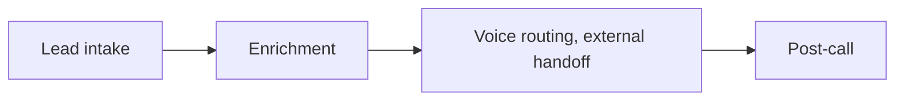
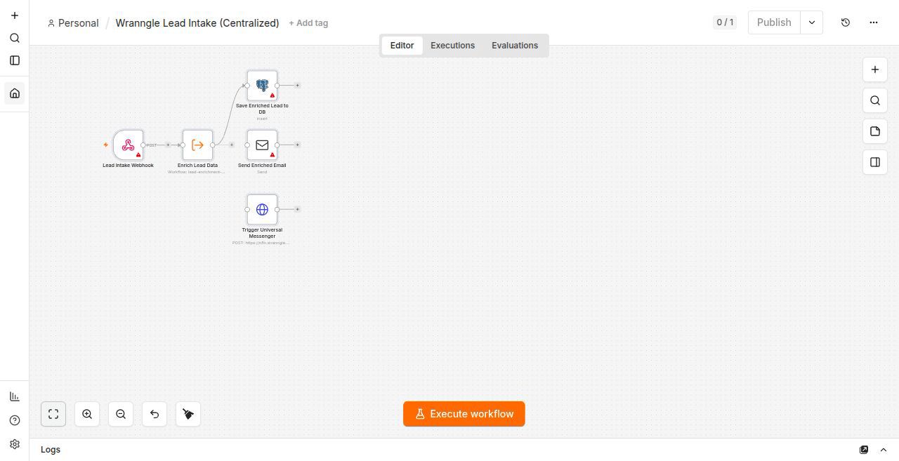
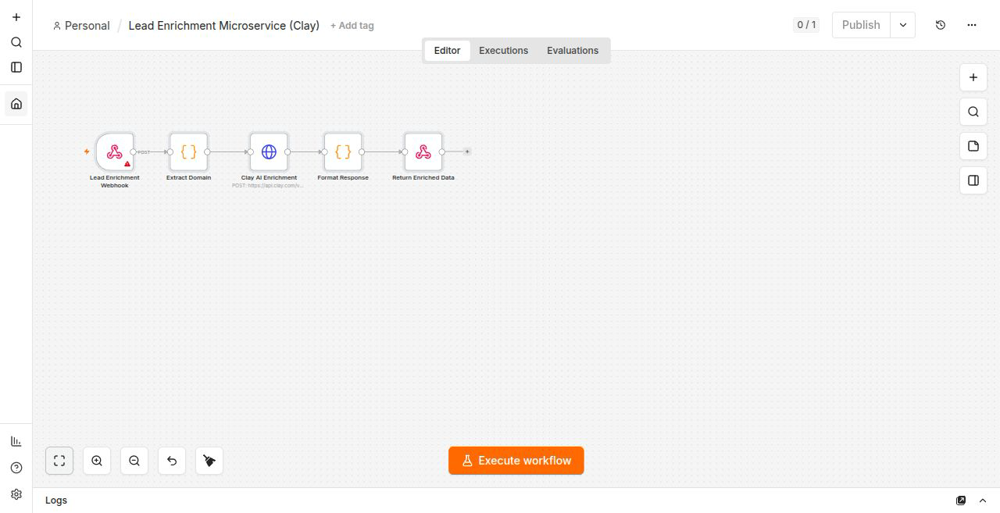
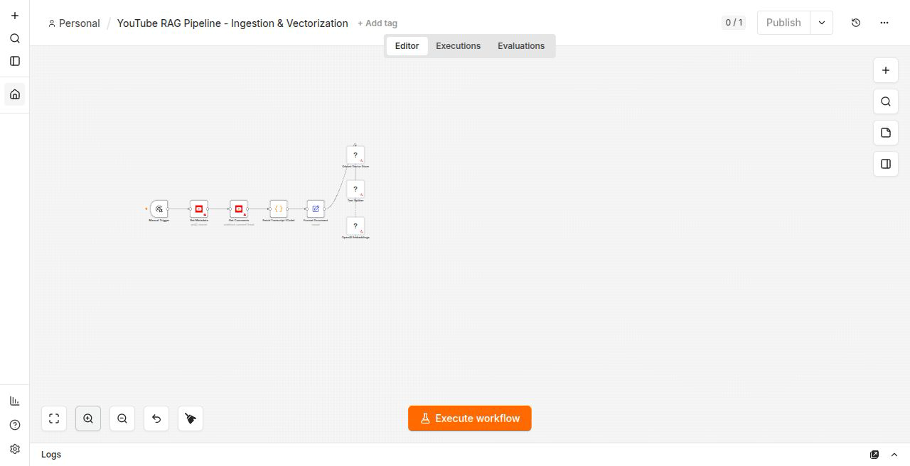

<div align="center">
<picture>
  <source media="(prefers-color-scheme: dark)" srcset="docs/brand/n8n-wordmark-dark.png">
  <source media="(prefers-color-scheme: light)" srcset="docs/brand/n8n-wordmark-light.png">
  
</picture>

#### a workflow library for n8n · lead intake · lead enrichment · post-call processing · webhook security middleware

# Install a sanitized, governed n8n workflow in one command

**[Demo](#-demo) | [Quick start](#-quick-start) | [Features](#-features) | [Canvas](#-on-the-canvas) | [Install](#-one-click-install) | [Uninstall](#-uninstall-a-workflow) | [Diff](#-diff-two-workflows) | [Drift](#-drift-detector) | [Governance](#-workflow-governance) | [Security audit](#-security-audit-status)**

```bash
node scripts/install-workflow.js workflows/lead-intake-main.json \
  --n8n-url http://localhost:5678 --api-key "$N8N_API_KEY"
```

**❤️ [Sponsor this project](https://github.com/sponsors/wranngle) ❤️**

[](https://github.com/wranngle/n8n/actions/workflows/ci.yml)
[](LICENSE)
[](https://github.com/wranngle/n8n/commits/main)
[](https://github.com/wranngle/n8n/graphs/contributors)

[](https://github.com/wranngle/n8n/stargazers)
[](https://github.com/wranngle)
</div>

---

## 🎬 Demo

[](docs/install-demo.mp4)

*Registry list, REST API install, governance check, 3x speed.*

**This is a workflow library for [n8n](https://n8n.io), not the n8n product itself.** It holds sanitized lead-intake and post-call n8n workflows you can install, govern, and webhook-harden: 3 registry entries, 5 checked-in workflow JSON files, and the toolchain that installs, uninstalls, diffs, lints, and drift-checks them against a live instance. `main` is protected by 6 required status checks.

## 🪝 Features

- 🪝 **One-click install**: `scripts/install-workflow.js` imports a workflow JSON over the n8n REST API and prints the new workflow id.
- 🪝 **Uninstall with dry-run**: `bin/uninstall-workflow.js` deletes matches by name or id; `--dry-run` prints the exact API calls without mutating anything.
- 🪝 **Deterministic diff**: `scripts/n8n-diff.js` renders a markdown diff of nodes, connections, and env-var changes between two workflow files.
- 🪝 **Drift detector**: `bin/drift.js` compares workflows deployed on an instance against the repo and exits non-zero on any drift, so it can gate CI.
- 🪝 **Governance engine**: `scripts/governance-engine.js` enforces DEV and ARCHIVED phase rules and prints a single-line PASS or FAIL.
- 🪝 **Webhook hardening**: `scripts/secure-n8n-webhooks.js` and `scripts/secure-internal-callers.js` stamp shared-secret validation onto webhook surfaces, idempotently.
- 🪝 **Custom lint**: `bin/n8n-lint.js` ships 4 rules (hardcoded secrets, missing error handler, PII in node names, retry without idempotency) plus `--list-rules`.
- 🪝 **Fork-landing site**: `npm run build:site` emits one download page per workflow.

## 🧭 Where these workflows sit



Voice routing is an external handoff: the agent runtime lives at [`wranngle/voice_ai_agent_evals`](https://github.com/wranngle/voice_ai_agent_evals). This repo owns the workflow surfaces on both sides of it. The full picture is in [`ARCHITECTURE.md`](ARCHITECTURE.md).

## 🚀 Quick start

1. Clone and install:

   ```bash
   git clone https://github.com/wranngle/n8n.git
   cd n8n
   npm install
   ```

2. Point at your n8n instance via `N8N_URL` and `N8N_API_KEY` (see [`.env.example`](.env.example)).

3. Install a workflow:

   ```bash
   node scripts/install-workflow.js workflows/lead-intake-main.json
   ```

4. Run the governance check on it:

   ```bash
   node scripts/governance-engine.js workflows/dev/pipeline-test-webhook-processor.json
   ```

## 🪝 The four surfaces

<table>
<tr>
<td align="center" width="50%"><b>Lead intake</b><br/>webhook-triggered intake flow, <code>lead-intake-main</code>, 5 nodes</td>
<td align="center" width="50%"><b>Lead enrichment</b><br/>centralized Clay AI enrichment microservice, 5 nodes</td>
</tr>
<tr>
<td align="center" width="50%"><b>Post-call processing</b><br/>webhook processing downstream of the external voice handoff</td>
<td align="center" width="50%"><b>Webhook security middleware</b><br/>two idempotent scripts stamping <code>X-Webhook-Secret</code> validation</td>
</tr>
</table>

## 📸 On the canvas

The three registry workflows, imported from this repo onto a real n8n editor canvas:



*lead-intake-main, 5 nodes ([counts](docs/brand/canvas-measurements.json)).*



*lead-enrichment-microservice, 5 nodes.*



*youtube-rag-pipeline, 8 nodes.*

## 📦 What's in here

- **`workflows/`**: 5 workflow JSON files ([`lead-intake-main.json`](workflows/lead-intake-main.json), [`lead-enrichment-microservice.json`](workflows/lead-enrichment-microservice.json), `dev/`, `knowledge_management/youtube-rag-pipeline/`) plus the [`registry.yaml`](workflows/registry.yaml) that indexes 3 of them
- **`scripts/`**: installer, diff, governance engine, webhook hardening, and workflow API utilities
- **`bin/` + `lib/`**: drift detector, lint rules, uninstaller
- **`tests/`**: 56 bats tests across 7 files
- **`docs/`**: webhook auth rotation playbook and the install demo media

## ⚡ One-click install

Import a workflow JSON into a local n8n instance via its REST API:

```bash
node scripts/install-workflow.js workflows/lead-intake-main.json \
  --n8n-url http://localhost:5678 --api-key "$N8N_API_KEY"
```

On success the script prints the new workflow id and exits 0. `--n8n-url` and `--api-key` may also be supplied via `N8N_URL` / `N8N_API_KEY` env vars.

## 🧹 Uninstall a workflow

The reverse of the installer. Looks up workflows on the remote n8n instance and deletes each match.

```bash
# Preview what would be deleted
node bin/uninstall-workflow.js --name lead-intake-main \
  --n8n-url http://localhost:5678 --api-key "$N8N_API_KEY" --dry-run

# Delete by id
node bin/uninstall-workflow.js --id wf-42 \
  --n8n-url http://localhost:5678 --api-key "$N8N_API_KEY"
```

Exits non-zero if no workflows match or any `DELETE` fails.

## 🔍 Diff two workflows

A deterministic markdown diff between two workflow JSON files: nodes added, removed, and modified, connection delta, and env-var changes. Pair it with the installer for a review-before-you-ship pre-merge check.

```bash
node scripts/n8n-diff.js workflows/a.json workflows/b.json
node scripts/n8n-diff.js workflows/a.json workflows/b.json --out diff.md
```

Try it against the bundled fixture pair:

```bash
node scripts/n8n-diff.js fixtures/diff/a.json fixtures/diff/b.json
```

## 📡 Drift detector

Compare workflows deployed on an n8n instance against the JSON files tracked in this repo:

```bash
node bin/drift.js --n8n-url http://localhost:5678 --api-key "$N8N_API_KEY" \
  --workflows-dir ./workflows --out drift.md
```

The report groups results into `Only on instance`, `Only in repo`, and `Modified` (matched by `name`, compared via a canonical fingerprint that ignores `id`, `updatedAt`, and `active`). Exits non-zero when any drift is detected.

## 🌐 Fork a workflow

`npm run build:site` walks `workflows/` and emits one fork-landing page per workflow at `dist/site/<slug>/index.html`, each with a Download `.json` link and a one-line problem statement. Test contract: `npm run test:site`.

## 🔐 Webhook authentication

The hardening scripts add an `X-Webhook-Secret` header, validated against `N8N_WEBHOOK_SECRET`, but not every checked-in workflow is currently hardened. Rotation playbook: [`docs/WEBHOOK_AUTH.md`](docs/WEBHOOK_AUTH.md).

## 📜 Workflow governance

- **DEV**: all active development. Modifiable.
- **ARCHIVED**: deprecated, read-only. Deletion is blocked; archive instead.
- New workflows auto-tag as DEV.

<details>
<summary>Governance check output</summary>

```text
$ node scripts/governance-engine.js workflows/dev/pipeline-test-webhook-processor.json
Governance Check: PASSED
```

A violation prints the failure and exits 1.

</details>

## ✅ Security audit status

Each entry in [`workflows/registry.yaml`](workflows/registry.yaml) carries a `security.audited` ISO date and a `security.scanner` tag; `node scripts/generate-readme-table.js --check` exits non-zero if the table below drifts from the registry.

<!-- BEGIN SECURITY AUDIT TABLE -->

_Freshness reference: 2026-05-14. Entries audited within the last 90 days render green._

| Workflow | Audit status | Scanner |
| --- | --- | --- |
| `lead-enrichment-microservice` |  | gitleaks+verify |
| `lead-intake-main` |  | gitleaks+verify |
| `youtube-rag-pipeline` |  | gitleaks+verify |
<!-- END SECURITY AUDIT TABLE -->

## ⭐ Star history

<!--
Restore this line when api.star-history.com recovers from its outage:
[](https://www.star-history.com/#wranngle/n8n&Date)
-->

[Star history for wranngle/n8n](https://www.star-history.com/#wranngle/n8n&Date)

## 📄 License

MIT. See [`LICENSE`](LICENSE).
