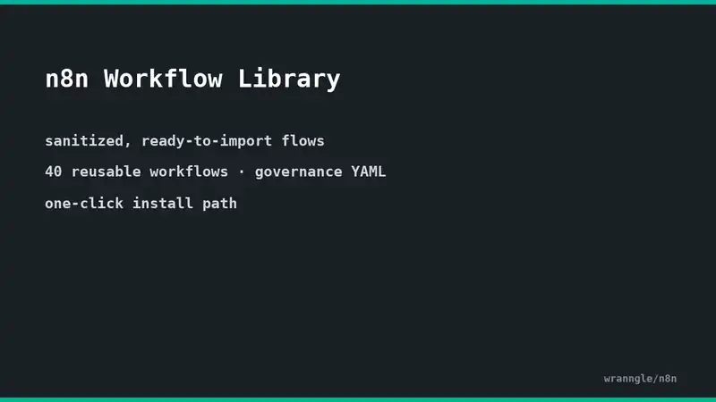

# n8n

> sanitized lead-intake and post-call n8n workflows you can install, govern, and webhook-harden

[](https://github.com/wranngle/n8n/actions/workflows/ci.yml) [](LICENSE) 

> [!NOTE]
> Active personal project. Used in my own workflow. Issues triaged on a personal-time cadence.

## Demo

[](docs/install-demo.mp4)

32-second slide walkthrough at 3x (click through for the full-speed mp4): list the registry's three entries, install a workflow over the n8n REST API, run the governance engine. Every count and output shown comes from a real run against this checkout. Re-render with `node scripts/generate-install-demo.mjs` (ffmpeg required).

## Quick start

```bash
git clone https://github.com/wranngle/n8n.git
cd n8n
npm install

# Workflow API utilities (require N8N_API_KEY)
node scripts/list_workflows.js
node scripts/activate-workflow.js --workflow <id>

# Governance audit (one workflow file per run)
node scripts/governance-engine.js workflows/dev/pipeline-test-webhook-processor.json

# Webhook security middleware (idempotent, run after creating new workflows)
node scripts/secure-n8n-webhooks.js --apply
node scripts/secure-internal-callers.js --apply
```

See [`.env.example`](.env.example) for required environment variables.

## What's in here

- **`workflows/`**: production flows ([`lead-intake-main.json`](workflows/lead-intake-main.json), [`lead-enrichment-microservice.json`](workflows/lead-enrichment-microservice.json), `dev/`, `knowledge_management/youtube-rag-pipeline/`) plus governance + registry YAMLs
- **`scripts/`**: workflow API utilities ([`activate-workflow.js`](scripts/activate-workflow.js), [`list_workflows.js`](scripts/list_workflows.js), `update_workflow.py`, etc.), governance ([`governance-engine.js`](scripts/governance-engine.js)), and webhook security ([`secure-n8n-webhooks.js`](scripts/secure-n8n-webhooks.js), [`secure-internal-callers.js`](scripts/secure-internal-callers.js))
- **`templates/`**: generic n8n templates
- **`tests/`**: workflow integration smoke tests
- **`context/`**: local knowledge bases (YouTube + Discord research) feeding the workflow generator

The checked-in workflows are generic n8n. The registry still carries legacy voice-agent workflow metadata (ElevenLabs business process, integration entries), but the live agent runtime lives at [`wranngle/voice_ai_agent_evals`](https://github.com/wranngle/voice_ai_agent_evals).

## Fork a workflow

`npm run build:site` walks `workflows/` and emits one fork-landing page per workflow at `dist/site/<slug>/index.html`. Each page carries a Download `.json` link, a placeholder workflow screenshot (`screenshot.svg`), and a one-line problem statement. If a deterministic fixture is present at `fixtures/<slug>.json` (round-1 [#24](https://github.com/wranngle/n8n/pull/24)), the page also links a sample payload so the fork story is end-to-end. Test contract: `npm run test:site`.

## Architecture

See [`ARCHITECTURE.md`](ARCHITECTURE.md) for the lead intake → CRM → call → post-call flow and how this repo connects to its satellites:

- [`wranngle/voice_ai_agent_evals`](https://github.com/wranngle/voice_ai_agent_evals): eval harness for ElevenLabs voice agents (the production agent runtime, prompt versioning, scenario framework)
- [`wranngle/gtm_ops`](https://github.com/wranngle/gtm_ops): unified GTM motion runtime (presales pipeline, ops-console, audit log surface)

## Webhook authentication

The hardening scripts can add an `X-Webhook-Secret` header, validated against `N8N_WEBHOOK_SECRET`, but not every checked-in workflow is currently hardened. See [`docs/WEBHOOK_AUTH.md`](docs/WEBHOOK_AUTH.md) for the rotation playbook. ElevenLabs HMAC-signed webhooks (different protocol, HMAC-SHA256 over `<timestamp>.<body>`) are handled in `voice_ai_agent_evals`.

## Test fixtures

[`scripts/generate-fixtures.js`](scripts/generate-fixtures.js) emits fixtures only for `workflows/live-universalized/` entries; the current checkout has none. When entries exist, it writes one deterministic synthetic payload per workflow into `fixtures/`, keyed by registry slug. The generator inspects each workflow's trigger node (webhook, form, schedule, manual, evaluation, pipedrive) and shapes the payload accordingly so every importable workflow can be smoke-tested without touching tenant data. Re-running the script over a clean checkout produces zero diff: fixture drift is the signal, not the noise.

## Workflow governance

- **DEV**: all active development. Modifiable.
- **ARCHIVED**: deprecated, read-only. Deletion is blocked; archive instead.
- New workflows auto-tag as DEV.

`workflows/governance.yaml` is the authoritative phase tracker; `scripts/governance-engine.js` enforces it. See [`WORKFLOWS.md`](WORKFLOWS.md) for the per-workflow index.

## Security audit status

Each workflow in `workflows/registry.yaml` carries a `security.audited` ISO date and a `security.scanner` tag. The table below is regenerated by [`scripts/generate-readme-table.js`](scripts/generate-readme-table.js); rerun it whenever an audit date is bumped, and `node scripts/generate-readme-table.js --check` exits non-zero if the table drifts from the registry.

<!-- BEGIN SECURITY AUDIT TABLE -->

_Freshness reference: 2026-05-14. Entries audited within the last 90 days render green._

| Workflow | Audit status | Scanner |
| --- | --- | --- |
| `lead-enrichment-microservice` |  | gitleaks+verify |
| `lead-intake-main` |  | gitleaks+verify |
| `youtube-rag-pipeline` |  | gitleaks+verify |
<!-- END SECURITY AUDIT TABLE -->


## One-click install

Import a workflow JSON into a local n8n instance via its REST API:

```bash
node scripts/install-workflow.js workflows/lead-intake-main.json \
  --n8n-url http://localhost:5678 --api-key "$N8N_API_KEY"
```

On success the script prints the new workflow id and exits 0. `--n8n-url` and `--api-key` may also be supplied via `N8N_URL` / `N8N_API_KEY` env vars.

## Uninstall a workflow

Reverse of `scripts/install-workflow.js`. Looks up workflows on the remote
n8n instance and deletes each match. `--dry-run` prints the exact API calls
without mutating anything.

```bash
# Preview what would be deleted
node bin/uninstall-workflow.js --name lead-intake-main \
  --n8n-url http://localhost:5678 --api-key "$N8N_API_KEY" --dry-run

# Delete by id
node bin/uninstall-workflow.js --id wf-42 \
  --n8n-url http://localhost:5678 --api-key "$N8N_API_KEY"
```

`--n8n-url` and `--api-key` also accept `N8N_URL` / `N8N_API_KEY` env vars.
Exits non-zero if no workflows match or any `DELETE` fails.

## Diff two workflows

`scripts/n8n-diff.js` renders a deterministic markdown diff between two
workflow JSON files: nodes added/removed/modified, connection delta, and
env-var changes. Pair it with the one-click installer above for a "review
before you ship" pre-merge check.

```bash
node scripts/n8n-diff.js workflows/a.json workflows/b.json
node scripts/n8n-diff.js workflows/a.json workflows/b.json --out diff.md
```

Demo against the bundled fixture pair:

```bash
node scripts/n8n-diff.js fixtures/diff/a.json fixtures/diff/b.json
```

## Drift detector

Compare workflows deployed on an n8n instance against the JSON files tracked in this repo:

```bash
node bin/drift.js --n8n-url http://localhost:5678 --api-key "$N8N_API_KEY" \
  --workflows-dir ./workflows --out drift.md
```

The report (`drift.md`) groups results into three sections: `Only on instance`, `Only in repo`, and `Modified` (matched by `name`, compared via canonical fingerprint that ignores `id`/`updatedAt`/`active`). The script exits non-zero when any drift is detected so it can gate CI.

## License

See [`LICENSE`](LICENSE).
