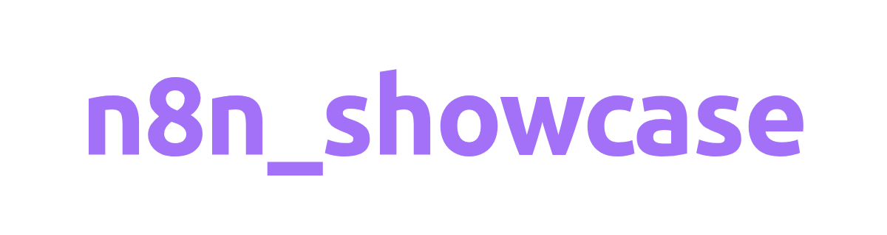
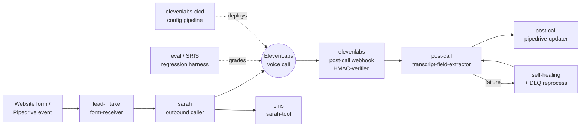

<div align="center">
<picture>
  <source media="(prefers-color-scheme: dark)" srcset="docs/brand/showcase-wordmark-dark.png">
  <source media="(prefers-color-scheme: light)" srcset="docs/brand/showcase-wordmark-light.png">
  
</picture>
</div>

# Sarah in production

A production voice-AI operation on n8n: the agent that phone-calls your leads,
the pipeline that turns every call into CRM data, and the eval framework that
proves the agent isn't getting worse. This repo holds sanitized exports of the
live workflows — 19 exhibits, 286 nodes, drawn from a fleet of 67 workflows
(33 active) on n8n.wranngle.com — plus the toolchain that keeps the exports
honest.

[](https://github.com/wranngle/n8n_showcase/actions/workflows/ci.yml)
[](https://github.com/wranngle/n8n_showcase/actions/workflows/drift.yml)
[](https://github.com/wranngle/n8n_showcase/actions/workflows/gitleaks.yml)

Every claim in this README maps to a command you can run and a gate that
blocks merge. The [drift check](docs/drift-report.md) re-fetches each exhibit
from the live instance daily and fails if the repo and reality diverge.

## The system



## The life of one phone call

Each chapter is a set of sanitized exports under `workflows/`, mapped to the
live instance by `workflows/exhibits.yaml`.

### 1. A lead lands

[`workflows/lead-intake/`](workflows/lead-intake/) — `form-receiver` (13
nodes, live name `[PROD]`). Website form posts arrive on an authenticated
webhook; the lead is validated, notified by email and RCS/SMS, and handed to
the outbound caller. Without it: leads sit in an inbox.

### 2. Sarah dials

[`workflows/sarah/`](workflows/sarah/) — `pipedrive-lead-auto-caller` (7
nodes) turns a CRM event into a live phone call in seconds; speed-to-lead is
the strongest conversion lever in outbound sales.
`outbound-caller-with-client-data` (13 nodes, active) injects CRM context
into the ElevenLabs session so Sarah knows who she's calling;
`outbound-caller-bulletproof` (12 nodes) is the retry-hardened variant;
`email-tool` (10 nodes) is the tool Sarah invokes mid-call to send a
follow-up email.

### 3. The call ends, the data doesn't

[`workflows/elevenlabs/`](workflows/elevenlabs/) — `post-call-webhook` (17
nodes) receives the transcript with HMAC signature verification;
`webhook-listener` (35 nodes, the largest workflow in the fleet) fans events
out to the processing lanes. [`workflows/post-call/`](workflows/post-call/) —
`transcript-field-extractor` (10 nodes, active) and `llm-extraction-engine`
(9 nodes, active) turn the raw transcript into structured fields;
`pipedrive-updater` (28 nodes) writes them to the CRM. Every call becomes CRM
data with zero human note-taking.

### 4. Failures don't vanish

[`workflows/post-call/`](workflows/post-call/) — `self-healing` (5 nodes) and
`dlq-reprocess` (3 nodes). Failed extractions queue and replay instead of
disappearing. The difference between a demo and an operation is what happens
on the bad day.

### 5. The system grades itself

[`workflows/eval/`](workflows/eval/) — SRIS, a regression harness for a phone
personality: `sris-master-orchestrator` (11 nodes, active) runs scenario
suites against the agent, `sris-verification-loop` (10 nodes, active) checks
outcomes, `voice-agent-tester` (18 nodes, active) drives simulated calls, and
`testing-framework-data-table-api` (29 nodes, active) stores cases and scores
in n8n Data Tables. Change the prompt on Tuesday, know by Wednesday whether
it got worse.

### 6. Revisions ship through a pipeline

[`workflows/cicd/`](workflows/cicd/) — `elevenlabs-cicd` (12 nodes, live name
`[PROD]`, active). The voice agent's configuration deploys through a
versioned pipeline with validation gates — not panic-edits in a web console.

### 7. The conversation continues across channels

[`workflows/sms/`](workflows/sms/) — `sarah-tool` (20 nodes, live name
`[PROD]`, active) lets Sarah text you a booking link mid-call;
`universal-message-sender` (24 nodes, active) is the shared delivery lane
with auth, validation, and retry.

## Numbers, each with its command

| Claim | Reproduce with |
|---|---|
| 19 exhibits, in sync with the live instance | `npm run drift` — [latest report](docs/drift-report.md) |
| 67 workflows / 33 active on the fleet | `npm run registry` → [workflows/registry.yaml](workflows/registry.yaml) |
| 0 sanitization violations in exhibits | `npm run verify` |
| 0 governance errors (32 live-drift warnings, reported honestly) | `npm run governance` |
| 60 Code-node snippets, 0 syntax failures | `npm run check:code-nodes` |
| 17 lint findings, ratcheted (may shrink, can't grow) | `npm run lint:ratchet` — [lint-baseline.json](lint-baseline.json) |
| 21 behavior tests | `npm test` |

## How the exhibits are made

`scripts/export-live-workflows.js` fetches each workflow in
[`workflows/exhibits.yaml`](workflows/exhibits.yaml) from the live instance
and pipes it through `scripts/sanitize-workflow.js`, which strips instance
state (ids, versions, timestamps, credentials, pinData, webhookIds) and
redacts secret-shaped strings — ElevenLabs keys and webhook secrets, Google
API keys, Twilio SIDs, JWTs, agent ids, phone numbers — leaving
`<REDACTED:...>` markers where the live workflow uses real values. The
sanitizer prints a receipt per file; gitleaks and the test suite check its
work.

Credentials never ship: nodes reference n8n credentials by name on the
instance, and the `credentials` key is stripped on export. `verify-workflows`
fails the build if any forbidden key reappears.

## Install an exhibit

```bash
node scripts/install-workflow.js workflows/lead-intake/form-receiver.json \
  --n8n-url https://your-n8n.example.com --api-key "$N8N_API_KEY"
```

POSTs to `/api/v1/workflows` (the endpoint that actually accepts API-key
auth) and prints the new workflow id. The workflow arrives deactivated;
wire credentials in your n8n and activate. n8n's own **Import from File**
button does the same job by hand — the script exists for scripted setups
and for CI.

## The toolchain

| Command | What it proves |
|---|---|
| `npm run drift` | every exhibit equals the sanitized live workflow, byte for byte |
| `npm run export` | refreshes exhibits from the instance (the fix for drift) |
| `npm run registry` | regenerates the fleet inventory + governance ledger mechanically |
| `npm run verify` | no credentials/pinData/webhookId/staticData in any exhibit |
| `npm run governance` | doctrine compliance; errors gate merge, live drift reports as warnings |
| `npm run lint` / `lint:ratchet` | 4 ops-quality rules (secrets, error handling, PII, idempotent retries) |
| `npm run check:code-nodes` | all Code-node JS compiles in n8n's async context |
| `node scripts/n8n-diff.js a.json b.json` | deterministic human-readable workflow diff |

## Governance

Two real phases: `[DEV]` (modifiable) and `[ARCHIVED]` (read-only, deletion
forbidden). [`workflows/governance.yaml`](workflows/governance.yaml) is
generated from the live fleet and includes a `known_drift` section — the
dual-active version pair, unphased legacy names, and version-suffixed names
that exist on the instance today are listed there rather than papered over.

## What this repo is not

The ElevenLabs agent configs, the Pipedrive schema, and the runtime live on
their own platforms; this repo showcases the n8n layer and the discipline
around it. The workflow exports are exhibits with a drift guarantee, not the
operational source of truth — the instance is.

## License

[MIT](LICENSE)
